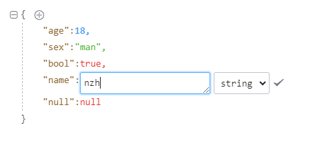

# json-edit-vue3

## DEMO

```sh
# install
npm run pre

# for vue 3.x app
npm run dev

```

## How to use

```sh
# install
npm install json-edit-vue3 --save

# require
import jsonEdit from "json-edit-vue3";
import "json-edit-vue3/dist/style.css";
```

### Type-Check, Compile and Minify for Production

```sh
npm run build
```




## example

```html
        <jsonEdit
              v-model:data="json"
              :theme="theme"
              :deep="deep"
              :iconStyle="iconStyle"
              :fontSize="fontSize"
              :lineHeight="lineHeight"
              :closed="closed"
              :iconColor="iconColor"
            />
```

## prop

| prop       | type          | require | description                                     | default |
| ---------- | ------------- | ------- | ----------------------------------------------- | ------- |
| data       | Object、Array | false   |                                                 | {}      |
| theme      | String        | false   | 主题 (one-dark、vs-code)                        | default |
| deep       | Number        | false   | 展开深度                                        | 3       |
| iconStyle  | String        | false   | 折叠icon样式 (circle、triangle)                 | square  |
| fontSize   | Number        | false   | 文字大小                                        | 14      |
| lineHeight | Number        | false   | 行高                                            | 24      |
| closed     | Boolean       | false   | 是否折叠                                        | false   |
| iconColor  | Array         | false   | icon颜色（打开/关闭），例["#747983", "#747983"] | ()=>[]  |
| isReadonly | Boolean       | false   | 是否只读                                        | false   |
